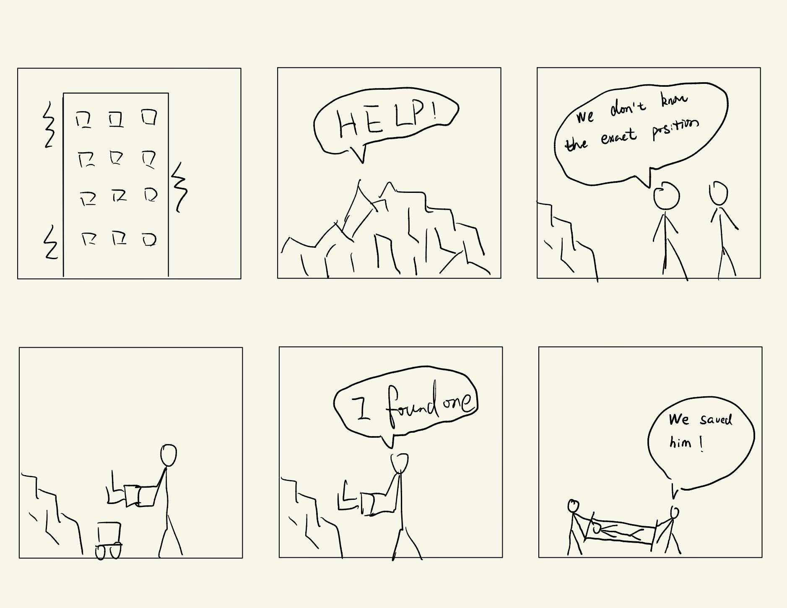
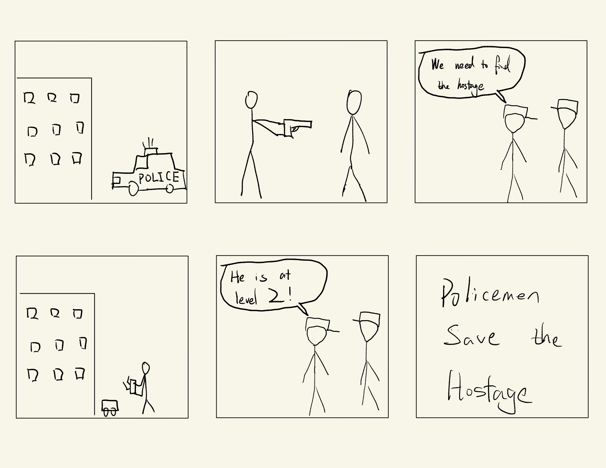

# Interaction First

## Names

Jamie Cao (jc2974), Chenran Ning (cn257), Tingkang Zhao (tz275)

## Storyboard

### Fire robot
Setting: Happening on a fire scene
Players: Fireman, people waiting to be rescued
Activity: fireman search the people stuck on the fire scene
Goals: The fireman will control the robot for terrain exploration and search and rescue personnel

### Earthquake rescue robot
Setting: Happening in earthquake ruins
Players: people trying to rescue, people waiting to be rescued
Activity: People trying to save search the people waiting to be rescued
Goals: The people trying to save use the robot for searching and rescue 

### Police robot
Setting: Happening in a criminal sense
Players: Policeman, hostage
Activity: Policemen search and make a plan to rescue a hostage
Goals: Policeman use the robot to monitor the crime sense and use the image get from the robot to make a detailed rescue plan

### Metronome robot
Setting: a songwriter is trying to write songs
Players: songwriter
Activity: write songs with the help of metronome
Goals: a more interesting way of metronome

### Advertisement robot
Setting: a new product is created
Players: product creator, customer
Activity: people trying to advertise their products to customers
Goals: draw people’s attention to the product 

## Videos

Fire fighter robot:
https://youtu.be/Z-U7mA_T_jk

Metronome robot:
https://youtu.be/-BYsNBfd6x4

Advertisement robot:
https://youtu.be/_i11T16hWGo

## Reflection

\*\***Are there things that seemed better on paper than acted out?**\*\*

No, surprisingly, everything seemed to work out well.

\*\***Are there new ideas that occur to you or your collaborators that come up from the acting?**\*\*

In the firefighter robot, we could add a sound module into our robot to communicate with the people in need.
