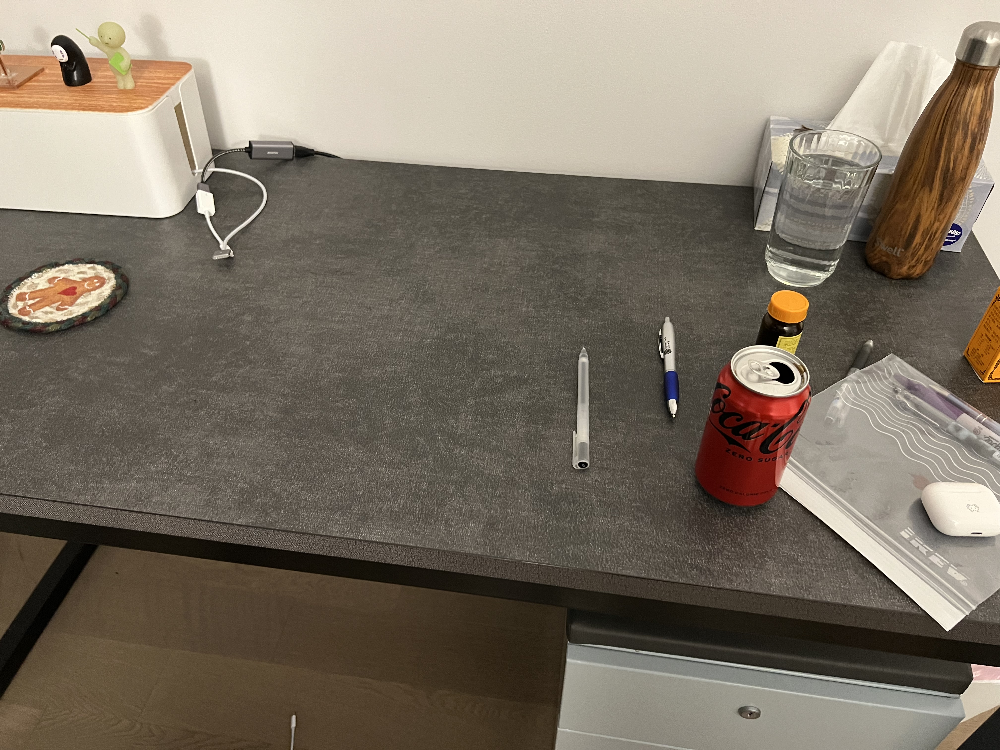
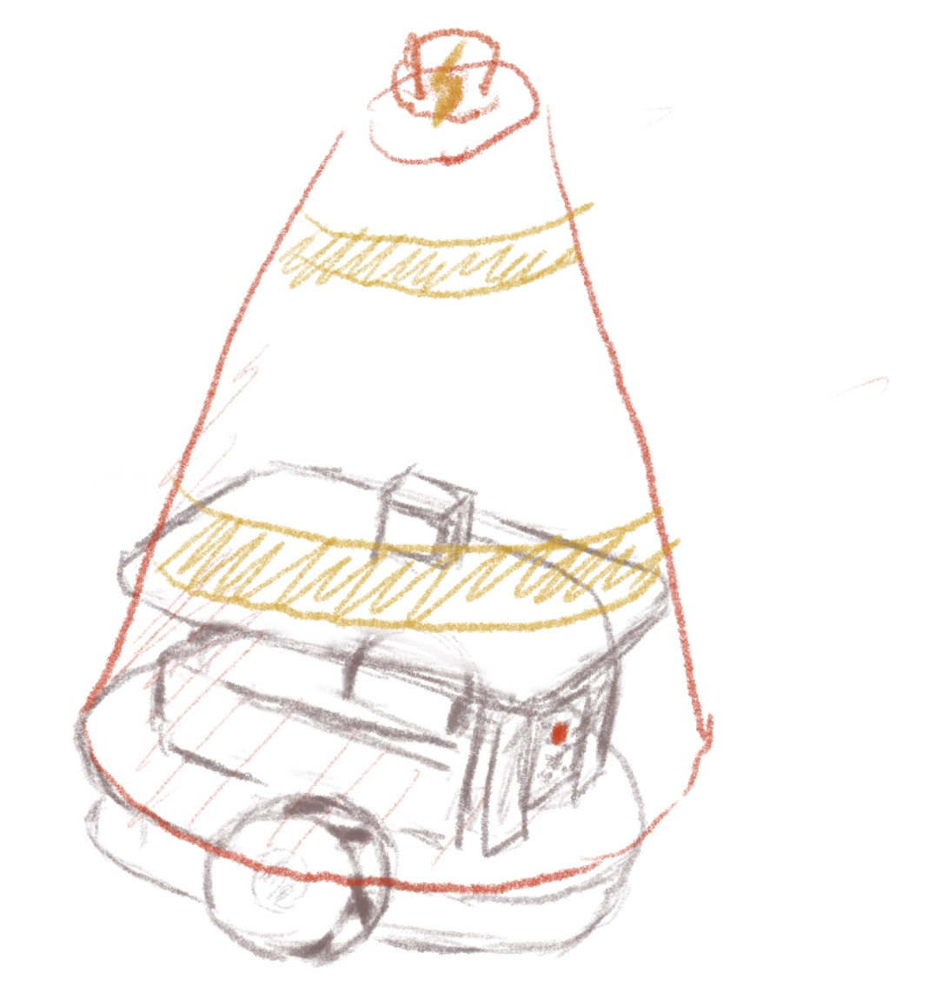
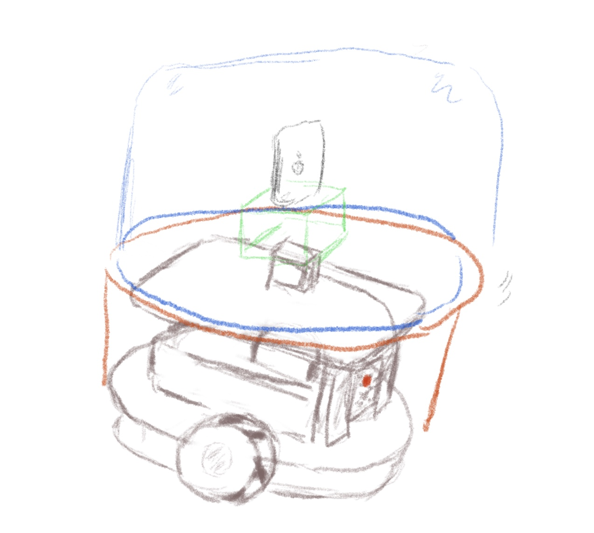
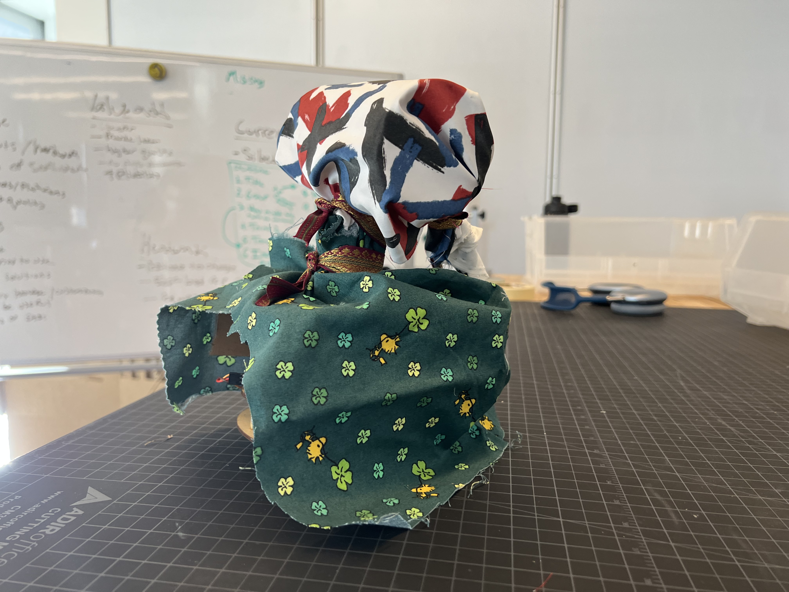
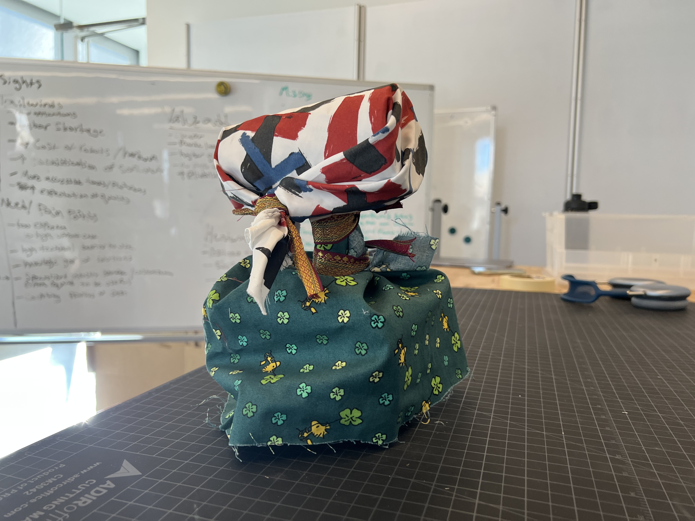
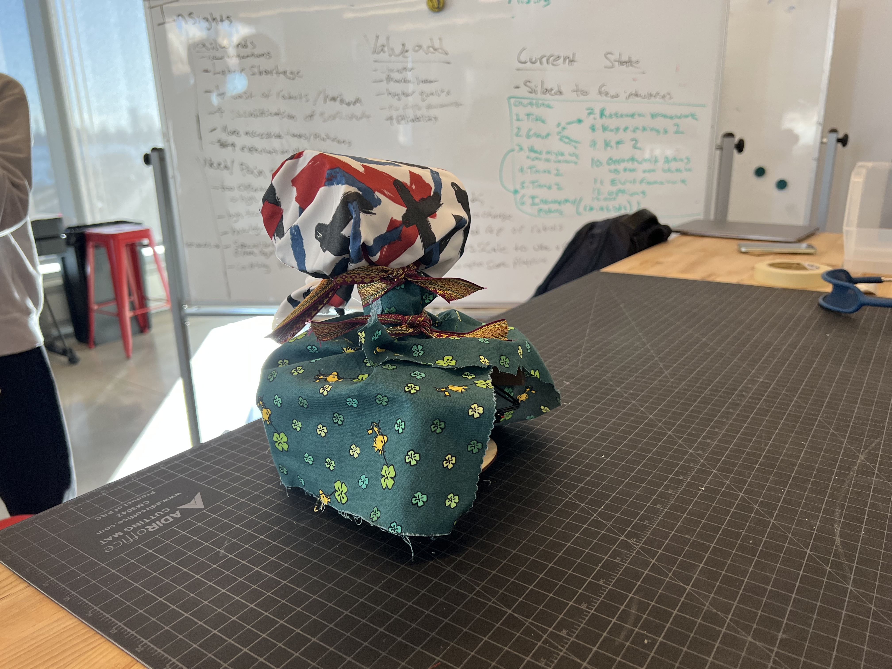
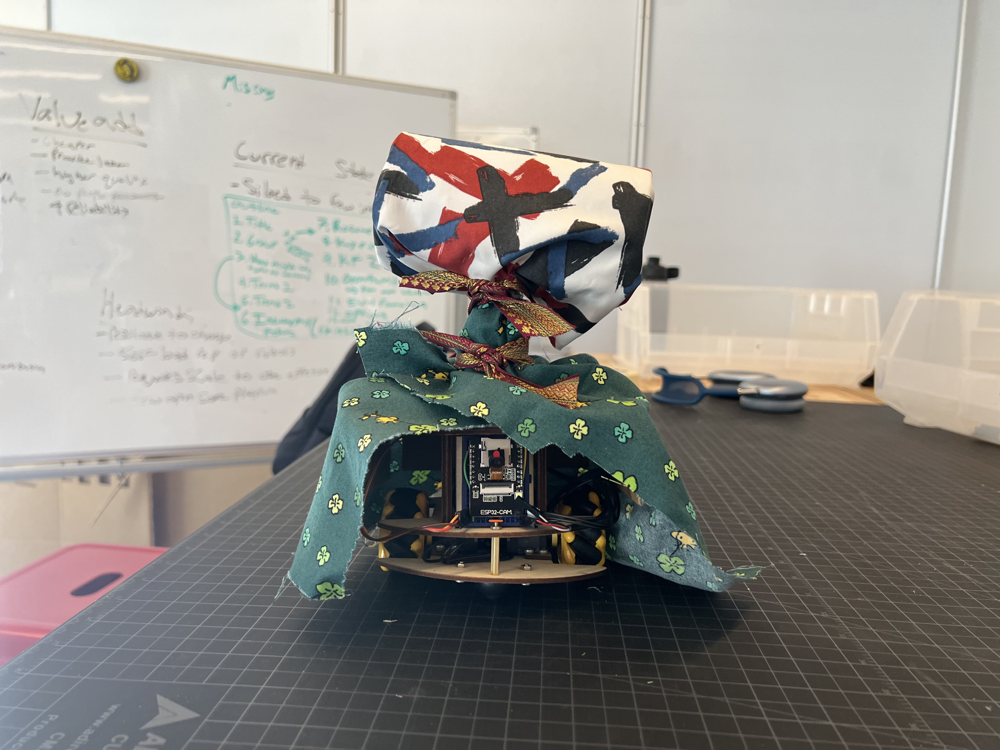
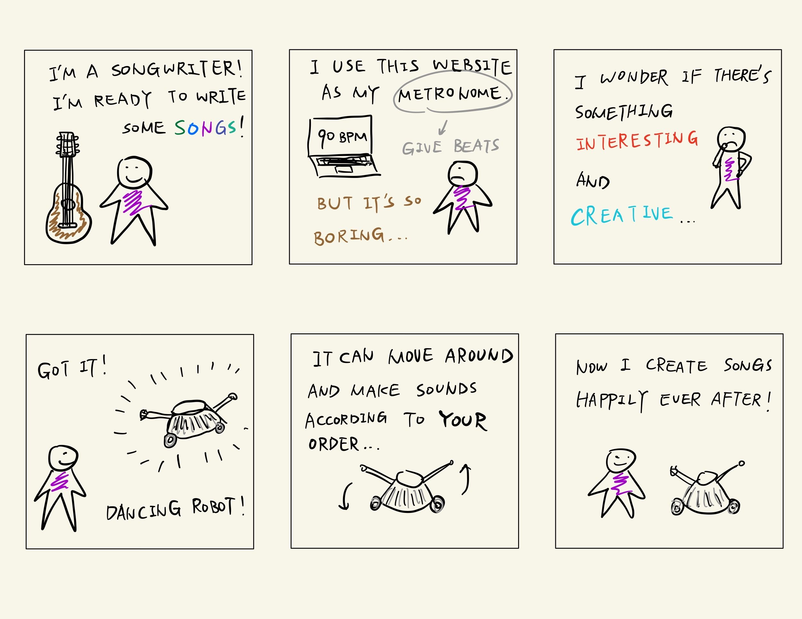

# Then Prototype the Robot

Jamie Cao (jc2974), Chenran Ning (cn257), Tingkang Zhao (tz275)

## Part A. Provide Feedback

### Feedback on [Sylvie's team](https://github.com/sylvie7788/Mobile_HRI_Lab_Hub/blob/main/Lab1/Readme.md)

We think the idea of the pet-accompanying robot is really great! It will definitely become common use case in the future. And the storyboard as well as the video that you made is really informative and fun. We can see in the video that little Rosie was heart-broken alone at home, but got better because of the robot.

### Feedback on [Jonathan's team](https://github.com/JMortonTan/Mobile_HRI_Lab_Hub/blob/main/Lab1/jmt362_Readme.md)

We think the ideas of the robot are really interesting. We can see that the robot can be used to help people to do some daily tasks, like watering plants and charging phones, which are really helpful. The storyboards are really informative and the videos are fun to watch.

## Part B. Site the interaction

### Firefighter robot
- Where the interaction you are prototyping is going to occur: Office buildings

- What other people and objects are in that space: firefighter, sufferer, fire extinguisher, fire, smoke
- What activities are going on in that space: Running into different rooms to find sufferers, rescuing the sufferers
- What activity is the robot going to be involved in: people waiting for rescue in a fire.
- What issues or opportunities arise from the site and activities: 
One issue that needs to be addressed is the safety of the robot in high-temperature environments, which must be ensured before it can be put into operation. However, the use of the robot presents opportunities to improve search efficiency and increase the safety of firefighters.

### Advertisement robot
- Where the interaction you are prototyping is going to occur: Office buildings

- What other people and objects are in that space: anyone and everything (employees, desks, monitors, etc.)
- What activities are going on in that space: running into different rooms to display the designated advertisements
- What activity is the robot going to be involved in: promoting products or services, providing customer service
- What issues or opportunities arise from the site and activities:
One issue that could arise from technical limitations is the need for the robot to have a lot of perception hardware to navigate around the building and operate the elevator independently, which may cause low battery life. On the other hand, an opportunity that could arise from using a robot is the potential to increase brand visibility and enhance a company's technological capabilities.

### Metronome robot
- Where the interaction you are prototyping is going to occur: personal space

- What other people and objects are in that space: laptops, speakers, any instruments (piano, saxophone, guitar, etc.)
- What activities are going on in that space: dance in an assigned BPM
- What activity is the robot going to be involved in: dance
- What issues or opportunities arise from the site and activities: 
One potential issue with the robot is its limited adaptability to changes in tempo or music style, which may restrict its usefulness in certain contexts. On the other hand, the robot's entertainment value could help alleviate the monotony of music creation for composers and increase their creative output.

## Part C. Costume the robot

### Sketches

#### Firefighter robot

#### Advertisement robot

#### Metronome robot

### Photos

#### Metronome robot

### Reflection

We want this robot to look somewhat artistic in order to fit its use case (used by songwriters when creating music). So we used a variety of bright colors to make it look beautiful. And we made sure that the costume was tightly glued to the robot's body, so that it will not fall off when dancing around.

## Part D. Wizard the Robot

### Metronome Robot first attempt and follow-up work

https://youtu.be/DqLu32dOoks

## Part E. Record

### Storyboard

### Video

https://youtu.be/3zqq2Ws-zl0
